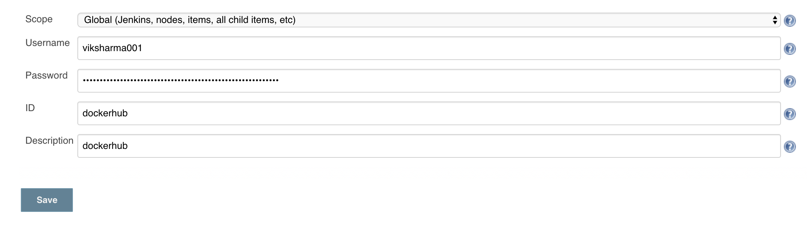

# parse-server-example

It contain parse-server app on kubernetes cluster using helm chart.
## Getting Started
These instructions will get you a copy of the project up and running on your local machine for development and testing purposes. See deployment for notes on how to deploy the project on a live system.

### Prerequisites

```
Docker
helm chart
k8s
jenkins
Docker registry hub
```

### Installing
```
Configure the Dockerfile to build node app.
Configure Jenkinsfile pipeline script to build,deploy app on k8s using helm chart
Add credential of docker hub registry
```
<div align="center">
     
</div> 

## Authors

* **Vikas Sharma** - *work* - [github](https://github.com/vikas-prabhakar)


## Acknowledgments

* Hat tip to anyone whose code was used
* Inspiration
* etc
